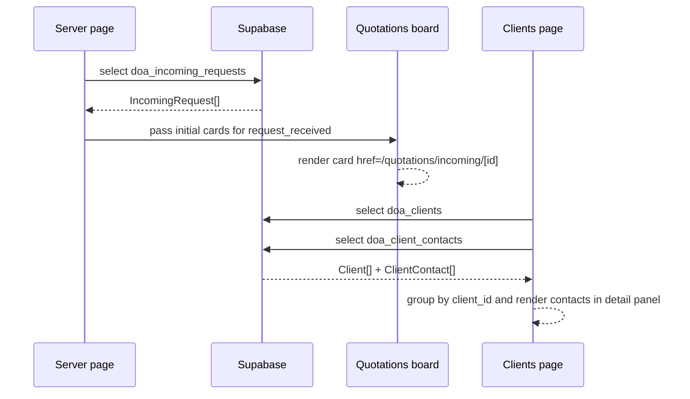

# Design: Connect Incoming Requests and Client Contacts

## Technical Approach

This change stays inside the current App Router pattern: server `page.tsx` files fetch Supabase data, then pass serializable props to client components. `Quotations` will stop rendering an empty board and will hydrate the first lane from `doa_incoming_requests`. `Clients` will enrich the existing client list with `doa_client_contacts` and surface those contacts in the left detail panel.

The implementation is incremental. We do not change the workflow model, drag and drop, or the existing incoming-request detail route. We only add data wiring and a small card contract extension so the app becomes useful immediately without destabilizing the rest of the board.

## Architecture Decisions

| Decision | Choice | Alternatives considered | Rationale |
|---|---|---|---|
| Fetch on server | Load `doa_incoming_requests` in `app/(dashboard)/quotations/page.tsx` and contacts in `app/(dashboard)/clients/page.tsx`. | Client-side `useEffect`, or a new data layer first. | The repo already separates server pages from client UI. This preserves SSR and keeps the change aligned with current patterns. |
| Map incoming requests into cards | Convert `IncomingRequest` rows into board cards and inject them only into `request_received`. Keep real backend `status` as metadata and navigate to `/quotations/incoming/[id]`. | Reuse `/quotations/[id]` or introduce a second board model. | `/quotations/incoming/[id]` already exists and is the correct operational route. Reusing the board shell minimizes UI churn. |
| Build contact grouping in server page | Query `doa_clients` and `doa_client_contacts` separately, then group by `client_id` before passing `ClientWithContacts[]` to the client. | Relational Supabase select or a dedicated contacts store. | Separate queries are explicit, easy to debug, and avoid coupling the UI to a more complex relational shape while the feature is still being introduced. |

## Data Flow

### Quotations

`page.tsx` -> Supabase `doa_incoming_requests` -> `toIncomingQuery()` -> incoming card adapter -> `QuotationStatesBoard`

Incoming rows are normalized with the existing helper in `app/(dashboard)/quotations/incoming-queries.ts`. The board adapter maps each incoming query to a card shape compatible with the current lane rendering, but with a dedicated `href` pointing at the incoming detail route.

```text
Supabase rows -> toIncomingQuery() -> incoming card adapter -> lane "request_received" -> /quotations/incoming/[id]
```

### Clients

`page.tsx` -> clients query -> contacts query -> group by `client_id` -> `ClientsPageClient`

The client detail panel receives the selected `ClientWithContacts` entry. The left block renders the main client data first and then a compact contacts section ordered by `is_primary DESC, is_active DESC, created_at ASC`.

### Sequence



## File Changes

| File | Action | Description |
|---|---|---|
| `app/(dashboard)/quotations/page.tsx` | Modify | Fetch incoming requests in server scope and pass them into `QuotationsClient`. |
| `app/(dashboard)/quotations/QuotationsClient.tsx` | Modify | Accept initial board data and forward it to the board. |
| `app/(dashboard)/quotations/QuotationStatesBoard.tsx` | Modify | Render incoming-request cards and switch the card link to the incoming detail route. |
| `app/(dashboard)/quotations/quotation-board-data.ts` | Modify | Add an incoming-request card mapper and lane injection for `request_received`. |
| `app/(dashboard)/clients/page.tsx` | Modify | Fetch contacts and build `ClientWithContacts[]` before rendering the client surface. |
| `app/(dashboard)/clients/ClientsPageClient.tsx` | Modify | Render grouped contacts inside the left detail block. |
| `types/database.ts` | Reuse | Keep using `ClientContact` and `ClientWithContacts` as the contract. |

## Interfaces / Contracts

```ts
type IncomingQuotationCard = QuotationCard & {
  href: string
  kind: 'incoming_query'
  statusLabel: string
}

type ClientsPageData = ClientWithContacts[]
```

The board card contract needs one navigation field and one discriminator so the UI can treat incoming queries differently without rewriting the lane system.

## Testing Strategy

| Layer | What to Test | Approach |
|---|---|---|
| Unit | Incoming query mapping and contact grouping | Validate adapters with representative rows and ordering rules. |
| Integration | Server pages return hydrated props | Confirm `Quotations` and `Clients` render with real Supabase data. |
| E2E | Navigation and detail rendering | Check that a board card opens `/quotations/incoming/[id]` and client details show contacts. |

Verification should include `npm run lint`, `npm run build`, and `npm run smoke`, plus manual review of both pages.

## Migration / Rollout

No migration required. This change only reads existing tables and updates UI wiring. If the incoming board proves too visually dense, the rollout can be narrowed by keeping only the first lane populated and leaving the rest of the board untouched.

## Open Questions

- [ ] Should inactive contacts be hidden by default or shown with a muted treatment in the client panel?
- [ ] Which incoming-request fields should be shown first on the card: sender, subject, classification, or received time?
- [ ] Should the card copy reuse quotation terminology or use incoming-request terminology more explicitly?
