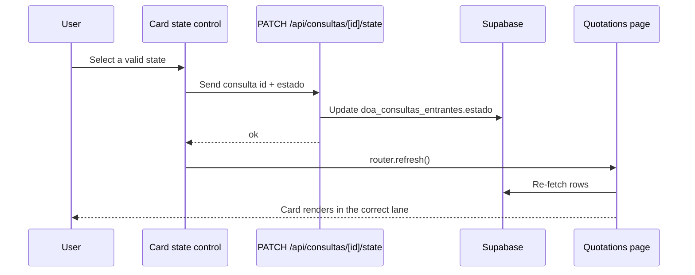

# Design: Map Incoming Cards by Real State

## Technical Approach

This change keeps `toIncomingQuery()` as normalization only and moves lane placement to the board adapter. `Quotations` will render incoming-query lanes from `WORKFLOW_STATE_SCOPES.INCOMING_QUERIES` as first-class lanes in the same workspace, instead of forcing every card into `entrada_recibida`. Manual state changes will go through a small dedicated API route that updates `doa_consultas_entrantes.estado`, then the client will refresh so the server page rehydrates and the card moves immediately.

## Architecture Decisions

| Decision | Alternatives considered | Rationale |
|---|---|---|
| Render incoming queries by scope-aware lane mapping | Keep forcing `entrada_recibida`, or rename the first lane | The repo already separates `quotation_board` and `incoming_queries`. Using the normalized incoming state as the lane key matches the real workflow without collapsing the model. |
| Add a dedicated state mutation route | Reuse `send-client` for every state change | Manual state changes are a separate concern from sending email. A dedicated `PATCH /api/consultas/[id]/state` keeps persistence idempotent and easier to reuse from the card UI. |
| Use a compact native select/button for the state control | Add a custom popover or new heavy UI component | The repo already uses simple shadcn primitives and Tailwind styling. A compact select next to `Más detalle` is lower risk and sufficient for the workflow. |

## Data Flow

```text
Supabase row
  -> app/(dashboard)/quotations/page.tsx
  -> toIncomingQuery()
  -> lane mapper by normalized incoming state
  -> QuotationStatesBoard
  -> card with state control

User changes state
  -> card control
  -> PATCH /api/consultas/[id]/state
  -> Supabase doa_consultas_entrantes.estado
  -> router.refresh()
  -> page.tsx refetches
  -> card appears in the new lane
```



## File Changes

| File | Action | Description |
|---|---|---|
| `app/(dashboard)/quotations/quotation-board-data.ts` | Modify | Stop forcing incoming cards into `entrada_recibida`; map them into incoming-query lanes by normalized state. |
| `app/(dashboard)/quotations/QuotationStatesBoard.tsx` | Modify | Render the incoming-query lanes, and add the state control next to `Más detalle` in board/list card actions. |
| `app/api/consultas/[id]/state/route.ts` | Create | Dedicated server route to validate and persist manual state changes to `doa_consultas_entrantes.estado`. |
| `app/api/consultas/[id]/send-client/route.ts` | Modify | Keep send-email state advancement aligned with the same state constants and persistence pattern. |

## Interfaces / Contracts

```ts
type ConsultaStateUpdatePayload = {
  estado: 'nuevo' | 'esperando_formulario' | 'formulario_recibido'
}

// PATCH /api/consultas/[id]/state
// Response: { ok: true, estado: ConsultaStateUpdatePayload['estado'] }
```

The dropdown must use the valid incoming-query states from `lib/workflow-states.ts` and reject anything outside that set.

## Testing Strategy

| Layer | What to Test | Approach |
|---|---|---|
| Unit | Lane mapping and state validation | Verify normalized incoming states map to the expected lane keys and invalid states are rejected. |
| Integration | Board refresh after save | Confirm `router.refresh()` rehydrates the board and the card moves after the API update. |
| E2E | Manual state change from card UI | In the browser, change a card state and confirm it reappears in the correct lane. |

## Migration / Rollout

No migration required. `doa_consultas_entrantes.estado` already exists, and this change only changes how the app maps and mutates that field.

## Open Questions

None.
